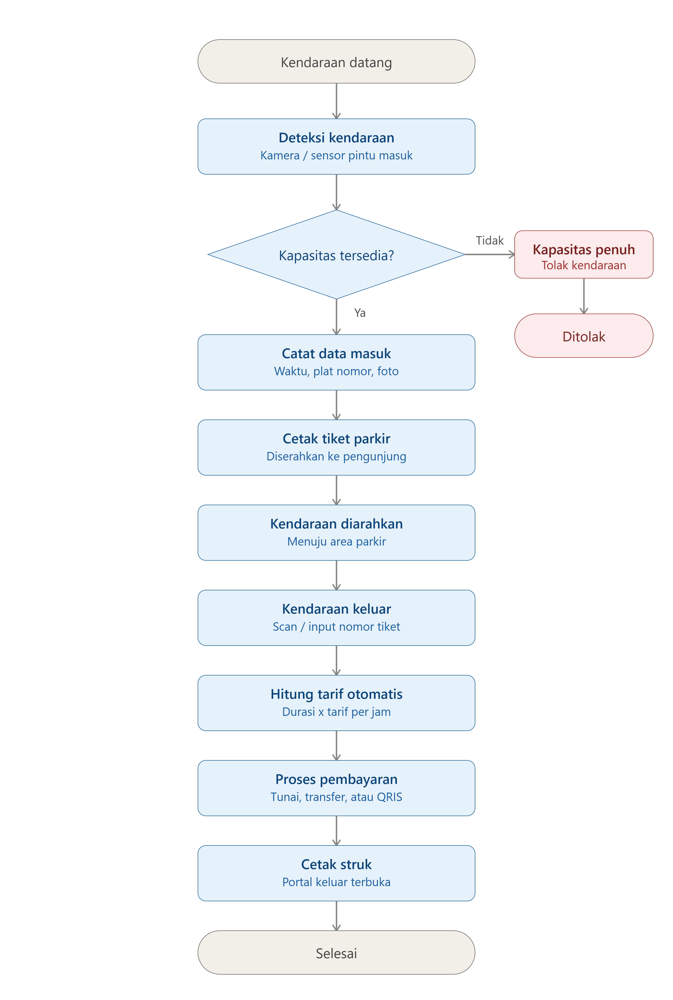
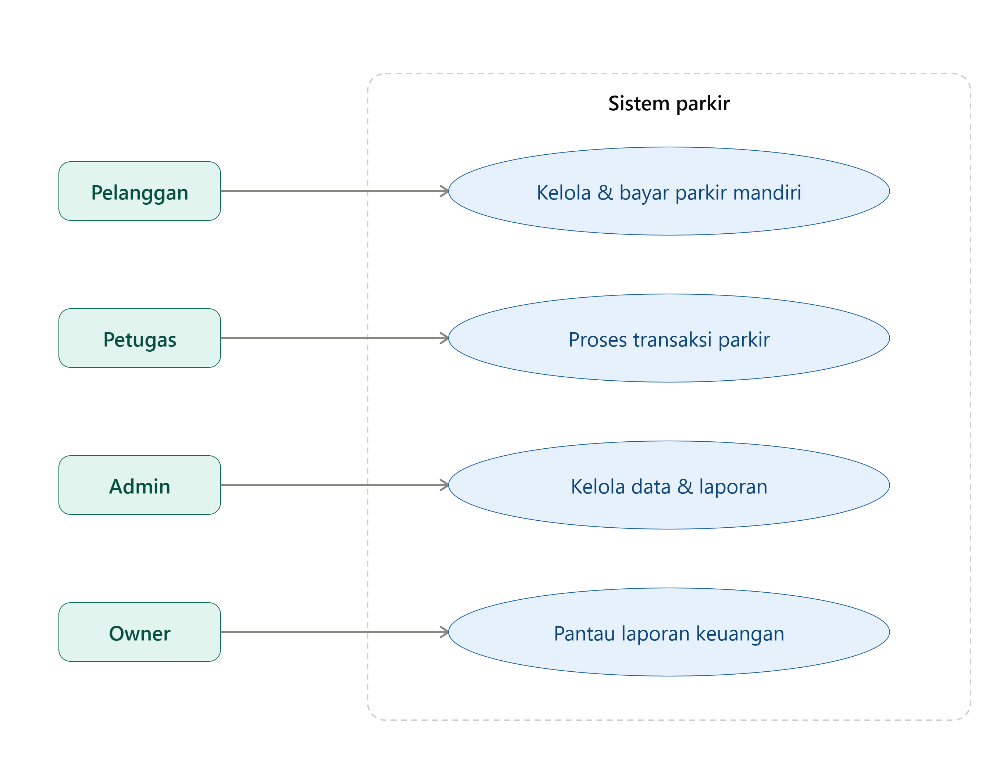
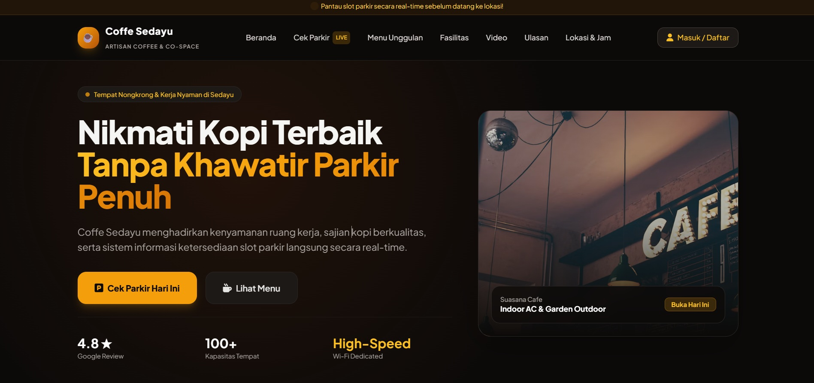
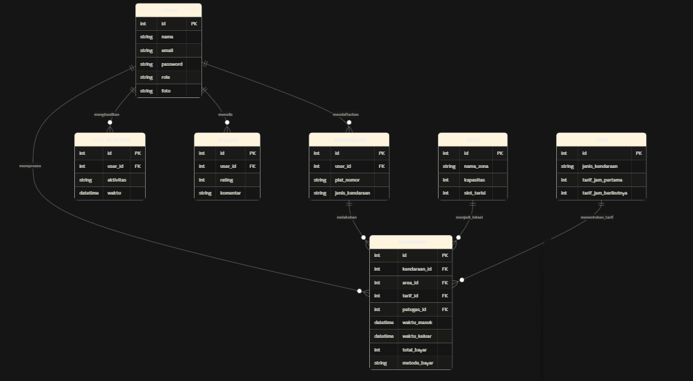
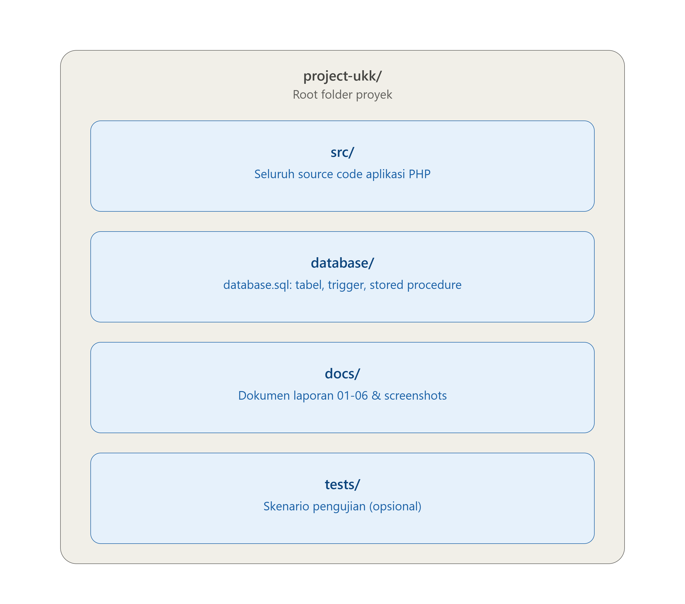

# Coffe Sedayu Parking System

Dokumentasi lengkap, panduan instalasi, dan struktur sistem untuk **Coffe Sedayu Parking System** — aplikasi manajemen parkir berbasis web terintegrasi profil kafe, dilengkapi database MySQL (`coffee_sedayu_parking`), perhitungan tarif otomatis via Stored Procedure, dan 4 tingkat hak akses pengguna.

---

## 📋 Daftar Isi

1. [Tentang Proyek](#-tentang-proyek)
2. [Fitur Utama](#-fitur-utama)
3. [Struktur Database](#-struktur-database)
4. [Persyaratan Sistem](#-persyaratan-sistem)
5. [Panduan Instalasi & Penggunaan](#-panduan-instalasi--penggunaan)
6. [Hak Akses & Kredensial](#-hak-akses--kredensial)
7. [Struktur Folder](#-struktur-folder)
8. [Dokumentasi Lengkap](#-dokumentasi-lengkap)
9. [Informasi Peserta](#-informasi-peserta)

---

## 🅿️ Tentang Proyek

**Coffe Sedayu Parking System** adalah sistem informasi parkir pintar yang dirancang untuk memantau kapasitas area parkir secara *real-time*, mencatat arus kendaraan masuk/keluar, menghitung tarif otomatis berdasarkan durasi parkir, mengelola transaksi pembayaran (Tunai/Transfer/QRIS), serta menyediakan dashboard khusus untuk pemilik usaha, admin, petugas lapangan, dan pelanggan.

Dibangun dengan PHP native + MySQL (PDO), tanpa framework, agar seluruh alur logika (autentikasi, CRUD, perhitungan tarif, trigger database) dapat ditelusuri langsung dari source code.



---

## 👥 Use Case Diagram

Diagram berikut menunjukkan aktor (Pelanggan, Petugas, Admin, Owner) dan fitur utama yang dapat mereka akses:



---

## ✨ Fitur Utama
## ✨ Fitur Utama

**Publik (Landing Page)**
:  
- Status ketersediaan slot parkir secara live
- Video profil suasana kafe & area parkir
- Ulasan & rating dari pelanggan
- Registrasi akun (otomatis menjadi role Pelanggan)

**Pelanggan**
- Dashboard: statistik pribadi (total kunjungan, total pengeluaran, kendaraan terdaftar)
- Daftarkan & kelola kendaraan sendiri (self-service)
- Bayar mandiri (Tunai/Transfer/QRIS) tanpa perlu ke petugas
- Riwayat kunjungan dengan filter & pencarian, export CSV pribadi
- Struk digital dengan QR Code

**Petugas**
- Dashboard shift harian (kendaraan diproses, pendapatan)
- Input kendaraan masuk (cetak karcis + QR Code)
- Proses kendaraan keluar (hitung tarif otomatis, cetak struk)
- Daftar kendaraan sedang parkir (klik cepat isi kode tiket)
- Validasi otomatis jika area sudah penuh

**Admin**
- CRUD penuh: User, Tarif Parkir, Area Parkir, Kendaraan
- Rekap transaksi dengan filter tanggal, export CSV & PDF
- Log aktivitas seluruh pengguna
- Performa petugas (ranking transaksi & pendapatan)

**Owner**
- Dashboard finansial mendalam (breakdown metode bayar, tren 6 bulan)
- Performa petugas & daftar staff (read-only)
- Laporan & export PDF

---

## 🗄️ Struktur Database

Database: `coffee_sedayu_parking` — 7 tabel utama:

| Tabel | Fungsi |
|---|---|
| `users` | Akun pengguna (owner, admin, petugas, pelanggan) + kontak & foto profil |
| `area` | Zona parkir, kapasitas, dan slot terisi (dihitung otomatis via trigger) |
| `tarif` | Tarif per jenis kendaraan (jam pertama & jam berikutnya) |
| `kendaraan` | Data master kendaraan, dapat ditautkan ke akun pelanggan |
| `transaksi` | Transaksi parkir dari masuk hingga keluar & pembayaran |
| `log_aktifitas` | Riwayat aktivitas pengguna untuk audit |
| `ulasan` | Ulasan & rating pelanggan di landing page |

Dilengkapi:
- **Trigger** `trg_masuk_update_area` & `trg_keluar_update_area` — update slot terisi otomatis
- **Stored Procedure** `sp_proses_keluar` — hitung tarif dengan `START TRANSACTION` / `COMMIT` / `ROLLBACK`
> Akun baru juga bisa dibuat langsung lewat halaman **Buat Akun** di aplikasi (otomatis menjadi role Pelanggan).



---

## ⚙️ Persyaratan Sistem

- PHP 8.0 atau lebih baru (dengan ekstensi PDO MySQL)
- MySQL 5.7+ / MariaDB 10.4+
- Web server (Apache — direkomendasikan XAMPP untuk lokal)
- Browser modern (Chrome, Edge, Firefox)

---

## 🚀 Panduan Instalasi & Penggunaan

1. **Clone repository ini**
   ```
   git clone https://github.com/[username]/[nama-repo].git
   ```
2. **Import database**
   Buka phpMyAdmin → buat database baru → Import → pilih file `database/database.sql`
3. **Salin source code**
   Salin isi folder `src/` ke folder `htdocs` (XAMPP) atau document root web server kamu
4. **Atur koneksi database**
   Buka `config.php`, sesuaikan `$host`, `$db`, `$user`, `$pass` dengan konfigurasi database kamu
5. **Jalankan**
   Aktifkan Apache & MySQL di XAMPP, lalu buka `http://localhost/[nama-folder]/` di browser

---


---

## 📁 Struktur Folder

```
project-ukk/
│
├── README.md
│
├── src/                        # Seluruh source code aplikasi (PHP)
│
├── database/
│   └── database.sql            # Struktur tabel + trigger + stored procedure
│
├── docs/
│   ├── 01-analisis-kebutuhan.pdf
│   ├── 02-perancangan.pdf
│   ├── 03-dokumentasi-program.pdf
│   ├── 04-pengujian.pdf
│   ├── 05-debugging.pdf
│   ├── 06-evaluasi.pdf
│   └── screenshots/
│       ├── login.png
│       ├── dashboard.png
│       ├── transaksi.png
│       └── pengujian.png
│
└── tests/
    └── (skenario pengujian, jika tersedia)
```
   
---

## 👤 Informasi Peserta

| | |
|---|---|
| **Nama Peserta** | [Narendra] |
| **Kelas** | [XII RPL1] |
| **Judul Project** | Coffe Sedayu Parking System |
| **Studi Kasus** | Aplikasi Parkir (P2) |
| **Demo Online** | [ISI LINK DEMO, CONTOH: https://parkircoffesedayu.free.nf] |

**Known Issues:**
- Stored procedure & trigger mungkin tidak berjalan di beberapa hosting gratis dengan privilege MySQL terbatas
- Metode pembayaran QRIS/Transfer masih berupa simulasi (belum terintegrasi payment gateway sungguhan)
